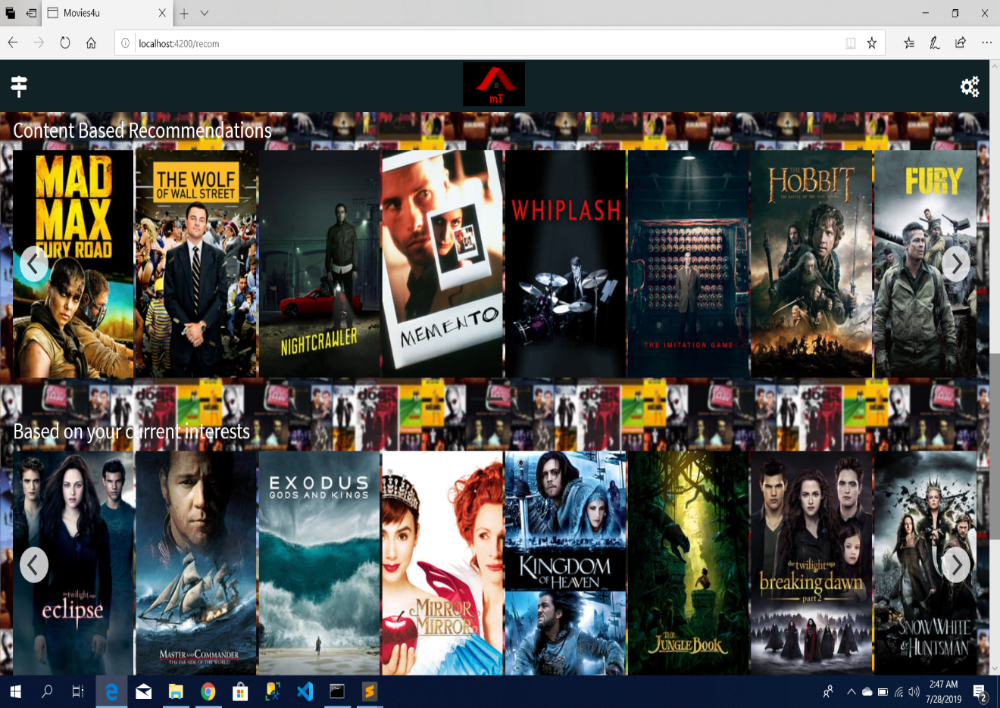

# Recommender



## Description

A basic Film Recommender. From an already generated database in csv with
- users
- films
- score of the films 

the user can interact and navigate this data base consulting it, modifying or adding information. 
The main focus is then, to give a recommendation of a given user based on the similarity that this user has with the other users.

Possibilities of the code:
```java
System.out.println("\nOptions: addMovie, addUser, deleteUser, addRating, " 
+ "changeRating, deleteRating, getRecommendation, showUsers, showMovies, showAllRatings, " 
+ "showUserRatings, showMovieRatings exit ");
```

## Installation

Used software:
1) IntelliJ IDEA 26.1
2) Data Model based on CSV Files

## Instructions

1) In RecommenderApp Class: compile
2) select option through command line

## Autor

The frame work of this project was given by **Roxanne Koitz-Hristov** in the subject *Data Strukturen und Algorithmen* 

Some methodes and classes such as *RecommendationEngine* 
*Data Loader

| Class | Methodes |
|----------|--------|
| RecommendationEngine | all |
| DataLoader | loadRatings |
| RecommenderApp | addMovie, addUser, deleteUser, addRating, changeRating, deleteRating,getRecommendation,showAllRatings, showUserRatings, showMovieRatings |

